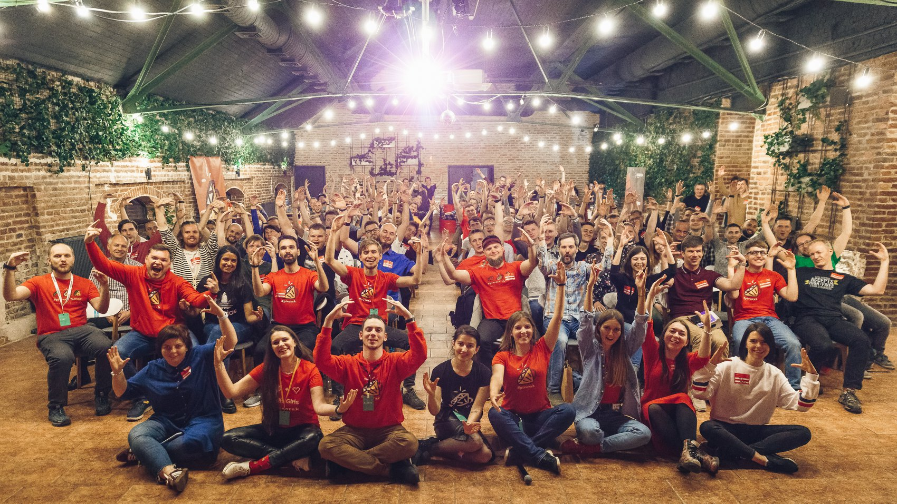

# [#pivorak](http://pivorak.com/) WebApp

**[Contribution and installation](./CONTRIBUTING.md)**

   

# Who we are?
We are Pivorak - a solid community of Rubyists in Lviv.
Now we’ve grown up enough to make our website.  
*Thanks to our contributors!*

# What we do?
We share experience, knowledge, love, and happiness.

# How we do this?
We do such events as:
  - #pivorak Ruby Meetups
  - #pivorak Ruby Conferences
  - #pivorak Ruby Summer Courses
  - #pivorak Rails Girls
  - #pivorak Rails Teens
  - #pivorak Workshops

And many more cool things!

We started in June 2015 and kept gathering for almost 4 years.
We are proud to have 30+ speakers and Aaron Patterson, Andrzej Krzywda, Piotr Solnica, Piotr Szotkowski, Nick Sutterer, Michał Papis, Miha Rekar, Ivan Nemytchenko, José Valim,  Tobias Pfeiffer, Sroop Sunar among them.

# How you can help us?
You can help us by **[contributing](./CONTRIBUTING.md)** to the *pivorak-web-app*!

You can *[report a bug](https://github.com/pivorakmeetup/pivorak-web-app/issues/new?labels=bug)*!

You can also support our community with **[Donation](https://pivorak.com/donate)**.

# How to get in touch with us?
Join our **[slack](http://pivorak-slack.herokuapp.com)** chat!
We have special `#pivorak-web-app` channel for contributors.

*Follow us on socials:* [youtube](https://www.youtube.com/channel/UCPsfLdQH_0CaDIe4imm7bMA/featured) | [facebook](https://www.facebook.com/pivorak) | [twitter](https://twitter.com/pivorakmeetup) | [instagram](https://instagram.com/pivorakmeetup)

